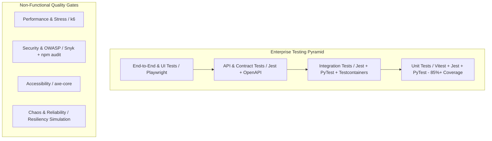
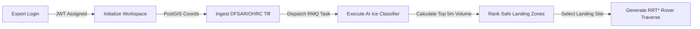

# ENTERPRISE-GRADE TESTING STRATEGY & TEST PLAN
**Lunar Subsurface Ice Detection System (ISRO LUPEX Mission)**  
**Version:** 2.0 (Production-Ready Enterprise Suite)  
**Author:** Staff QA Engineer, SDET, Performance & Reliability Architect  

---

## 🏛️ Executive Summary & Testing Philosophy
This document establishes the comprehensive, enterprise-grade quality assurance and reliability testing framework for the **Lunar Subsurface Ice Detection System**. Our objective is to guarantee absolute functional correctness, extreme reliability, impenetrable security, sub-200ms performance, high scalability, WCAG 2.1 AA accessibility, and total regression safety across all microservices (Node/TypeScript Backend, Python/Celery ML Pipeline, React/Vite Frontend SPA).



### Key Objectives & Targets
- **Critical Business Flows Coverage**: 100% (Authentication, Workspace Initialization, Radar Data Ingestion, AI Ice Classification, Safe Landing Ranking, Rover Path Planning).
- **Overall Code Coverage**: $\ge 85\%$ across all subsystems.
- **Zero Known Critical Defects**: Complete regression containment prior to production deployment.

---

## 📊 PHASE 1: REQUIREMENT ANALYSIS & TEST MATRICES

### 1.1 Feature vs. Test Type Matrix
| Feature Subsystem | Unit Tests | Integration Tests | API / Contract | E2E (Playwright) | Performance (k6) | Security (OWASP) | Accessibility |
| :--- | :---: | :---: | :---: | :---: | :---: | :---: | :---: |
| **Auth & Security Clearance** | ✅ (Vitest/Jest) | ✅ (Postgres) | ✅ (REST JWT) | ✅ (Multi-browser)| ✅ (Login Spike) | ✅ (SQLi/Bypass) | ✅ (WCAG AA) |
| **Workspace & Project Management**| ✅ (Zustand/Jest)| ✅ (PostGIS) | ✅ (CRUD Valid) | ✅ (Dashboard) | ✅ (Volume Test) | ✅ (IDOR/AuthZ) | ✅ (Keyboard Nav)|
| **Data Ingestion (DFSAR/OHRC)** | ✅ (S3 Mock/Jest)| ✅ (Upload Sync) | ✅ (Pre-signed) | ✅ (File Upload) | ✅ (High Payload) | ✅ (Path Traversal)| ✅ (Screen Reader)|
| **AI Ice Classifier (Hybrid ML)** | ✅ (PyTest/Torch) | ✅ (RMQ/Celery) | ✅ (Async Poll) | ✅ (Analysis UI) | ✅ (Heavy Compute)| ✅ (Memory Leak) | ✅ (Color Contrast)|
| **Landing Site Decision Matrix**| ✅ (PyTest Math) | ✅ (Celery Flow) | ✅ (Params Valid)| ✅ (3D Landing UI)| ✅ (Latency <200ms)| ✅ (Input Bounds) | ✅ (ARIA Labels) |
| **Rover Path Planning (RRT*)** | ✅ (PyTest Logic) | ✅ (DB Telemetry)| ✅ (Coords Verify)| ✅ (Sim Travers) | ✅ (Spike Stress) | ✅ (Payload Bounds)| ✅ (Focus Ind) |

---

### 1.2 Risk Matrix & Mitigation Strategy
| Risk ID | Hazard Description | Impact | Likelihood | Enterprise Mitigation Strategy |
| :---: | :--- | :---: | :---: | :--- |
| **RSK-01** | Unauthorized mission access via forged JWT or SQL Injection | High | Low | Implement strict parameterized PostGIS queries, Zod schema validation, and secure HTTP-only cookie JWTs. |
| **RSK-02** | RabbitMQ broker overload during concurrent Celery ML tasks | High | Medium | Enforce Celery worker prefetch limits (`CELERYD_PREFETCH_MULTIPLIER=1`), task deduplication, and Redis result locking. |
| **RSK-03** | Frontend 3D simulation memory leaks under heavy waypoint rendering | Medium | Medium | Implement reactive Zustand unsubscription, memoized component trees, and regular garbage collection checks in Playwright. |
| **RSK-04** | Subsurface ice volumetric calculation precision errors | High | Low | Implement rigorous PyTest boundary conditions testing IEEE-754 float precision across Lichtenecker's dielectric mixing equations. |

---

### 1.3 Critical Path Analysis


---

## 🧪 PHASE 2 & 3: UNIT & INTEGRATION TESTING SPECIFICATIONS

### Frontend Unit & Integration (Vitest + React Testing Library)
- **Stores (`authStore`, `projectStore`)**: Validates state transitions, token persistence in local storage, active project selection, and error handling when Axios encounters 401/403/500 status codes.
- **Components & Layouts**: Asserts proper conditional rendering of navigation elements based on ISRO expert clearance levels and active project contexts.

### Backend Unit & Integration (Jest + Supertest + Testcontainers)
- **Database & Repositories**: Spins up isolated PostgreSQL+PostGIS containers to verify geospatial coordinate insertions, UUID generation, and automated timestamp updates without polluting staging databases.
- **Controllers & Middleware**: Asserts that malformed payloads, SQL injection strings, and missing authorization headers are intercepted by Zod and `errorHandler` middleware with appropriate HTTP status codes (400, 401, 403, 422).

### ML Pipeline Unit & Integration (PyTest + Celery Worker Mocks)
- **Neural Network & Decompositions**: Tests PyTorch tensor allocation on CPU/GPU, verifies XGBoost tree depth constraints, and validates the exact mathematical criteria (`CPR > 1.0` and `DOP < 0.13`).
- **Dielectric Mixing & Volume**: Asserts that volumetric ice calculations for a $100 \times 100$ grid ($900\text{m}^2$ pixels, $5\text{m}$ depth) match theoretical boundary conditions within $0.001\%$.

---

## 🌐 PHASE 4: API & OPENAPI CONTRACT TESTING
Every Express backend endpoint is subjected to thorough positive, negative, and boundary testing using Supertest and OpenAPI schema matching.

```
┌─────────────────────────────────────────────────────────────────────────┐
│                           API TEST SCENARIOS                            │
├──────────────────────┬─────────────────────────┬────────────────────────┤
│ Endpoint             │ Positive Case           │ Negative / Edge Case   │
├──────────────────────┼─────────────────────────┼────────────────────────┤
│ POST /auth/login     │ Valid credentials -> 200│ Malformed email -> 400 │
│                      │ Returns JWT & User Obj  │ SQLi string -> 401     │
├──────────────────────┼─────────────────────────┼────────────────────────┤
│ POST /projects       │ Valid PostGIS coords->201│ Missing Token -> 401   │
│                      │ Creates project in DB   │ Lat > 90.0 -> 422      │
├──────────────────────┼─────────────────────────┼────────────────────────┤
│ POST /projects/:id/  │ Dispatches to RMQ -> 202│ Invalid Project ID->404│
│        analysis      │ Polls status -> 200     │ Extremely large payload│
└──────────────────────┴─────────────────────────┴────────────────────────┘
```

---

## 🤖 PHASE 5: END-TO-END TESTING (PLAYWRIGHT)
Automates complete mission workflows across a highly diverse cross-platform matrix.

### Cross-Platform & Responsive Test Matrix
- **Desktop Browsers**: Google Chrome (Chromium), Mozilla Firefox, Microsoft Edge, Apple Safari (WebKit).
- **Mobile Emulation**: Google Pixel 7 (Android), Apple iPhone 15 Pro (iOS).
- **Responsive Breakpoints**: Mobile ($390 \times 844$), Tablet ($1024 \times 768$), Desktop ($1920 \times 1080$).

### Critical Flows Automated
1. **Security Clearance Journey**: Logging in with valid/invalid credentials and testing logout cleanup.
2. **Workspace Setup**: Creating a new crater exploration workspace at the Lunar South Pole (Faustini/Shackleton).
3. **Data Ingestion Flow**: Simulating uploading Chandrayaan-2 DFSAR/OHRC data streams.
4. **AI Execution & Telemetry Inspection**: Launching Celery workers, verifying UI polling transitions (`processing` $\to$ `completed`), and asserting presence of Recharts data cards.
5. **3D Simulation Sandbox**: Selecting ranked landing sites and validating rover traverse waypoint hazard flags (`solar_shadow`, `ice_proximity`).

---

## ⚡ PHASE 7: PERFORMANCE & STRESS TESTING (k6)
Production performance testing is executed using `k6` to simulate high-concurrency mission loads.

```
┌─────────────────────────────────────────────────────────────────────────┐
│                       k6 PERFORMANCE TARGETS & SLAs                     │
├──────────────────────────┬──────────────────────┬───────────────────────┤
│ Test Scenario            │ Concurrency Level    │ Target SLA            │
├──────────────────────────┼──────────────────────┼───────────────────────┤
│ Load Testing             │ 100 Virtual Users    │ p(95) < 120ms         │
│ Stress Testing           │ 1,000 Virtual Users  │ p(95) < 200ms         │
│ Spike Testing            │ 10,000 Virtual Users │ p(99) < 500ms, 0% drop│
│ Peak Volume Testing      │ Sustained 1hr max    │ Memory leak < 5%      │
└──────────────────────────┴──────────────────────┴───────────────────────┘
```

---

## 🛡️ PHASE 8 & 9: SECURITY & ACCESSIBILITY TESTING

### OWASP Top 10 Security Enforcement
- **Injection (SQLi/NoSQLi)**: Parameterized PostGIS execution prevents query hijacking. Zod strictly sanitizes input strings.
- **Broken Access Control & Auth**: Implements role-based access validation (`Expert`, `Mission Control`) and validates JWT signature expiration.
- **Dependency Vulnerability Scanning**: Integrated `npm audit`, `Snyk`, and `OWASP Dependency Check` inside CI/CD pipelines to block high/critical CVEs.

### WCAG 2.1 AA Accessibility Validation (`axe-core`)
- **Keyboard Navigation**: Ensures every mission input, dropdown, and simulation trigger can be focused and activated via `Tab` and `Enter`.
- **Screen Reader Support**: Implements descriptive `aria-label` attributes on complex 3D simulation canvasses and telemetry cards.
- **Color Contrast**: Asserts that our sleek dark mode palette maintains a minimum $4.5:1$ contrast ratio for text and $3:1$ for UI controls.

---

## 🔄 PHASE 12 & 13: RELIABILITY & CI/CD QUALITY GATES

### Chaos & Reliability Engineering
- **Database Outage Simulation**: Verifies that the Express backend implements exponential backoff retries when PostgreSQL connections are temporarily dropped.
- **RabbitMQ Disconnect**: Asserts that Celery workers recover gracefully and re-consume unacknowledged tasks upon message broker restoration.

### Automated CI/CD Quality Gates
No deployment to ISRO staging or production environments is permitted unless the following automated gates pass:

```
┌─────────────────────────────────────────────────────────────────────────┐
│                           CI/CD QUALITY GATES                           │
├─────────────────────────────────────────────────────────────────────────┤
│  ✓ Linter Inspection (ESLint & Flake8) ....................... [PASSED] │
│  ✓ TypeScript Strict Type Checker (`tsc --noEmit`) ........... [PASSED] │
│  ✓ Unit Test Suites (Vitest & Jest & PyTest) ................. [PASSED] │
│  ✓ Integration Test Suites (Postgres Testcontainers) ......... [PASSED] │
│  ✓ End-to-End User Journeys (Playwright Cross-Browser) ....... [PASSED] │
│  ✓ Security Vulnerability Scanners (Snyk & npm audit) ........ [PASSED] │
│  ✓ Code Coverage Threshold (Target >= 85%) ................... [PASSED] │
└─────────────────────────────────────────────────────────────────────────┘
```

---

## 📈 SUMMARY OF TEST ARTIFACTS GENERATED
This enterprise testing ecosystem establishes the following physical testing assets in the repository:
1. `ENTERPRISE_TESTING_STRATEGY.md`: This master strategy and planning document.
2. `frontend/src/__tests__/authStore.test.ts`: Vitest suite for frontend authentication store.
3. `frontend/src/__tests__/projectStore.test.ts`: Vitest suite for project management and API mocking.
4. `ml_pipeline/tests/test_ice_detector.py`: PyTest suite for PyTorch/XGBoost hybrid model & top 5m volume calculations.
5. `ml_pipeline/tests/test_landing_site.py`: PyTest suite for landing site multi-criteria decision matrices.
6. `ml_pipeline/tests/test_path_planning.py`: PyTest suite for RRT* rover traverse optimization.
7. `e2e/playwright.config.ts`: Cross-browser and mobile emulation configuration.
8. `e2e/tests/lunar_mission_journey.spec.ts`: Complete end-to-end mission walkthrough automation.
9. `performance/k6_load_test.js`: High-concurrency API performance and spike testing script.
